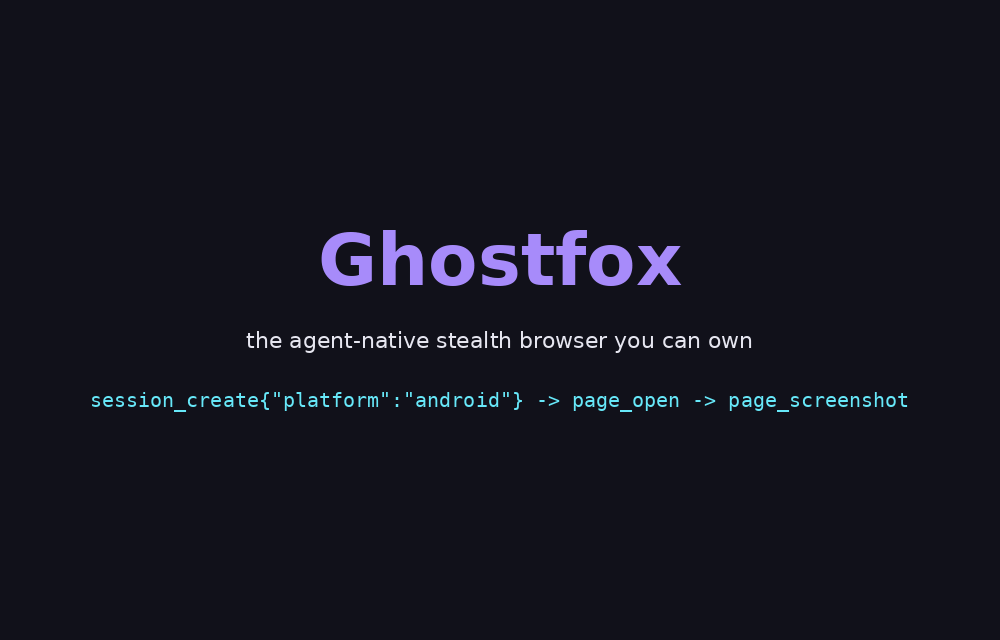

<div align="center">


# Ghostfox

**The agent-native stealth browser you can own.**

Self-hosted · Open source · MCP-first · Engine-level anti-detect

[](engine/LICENSE)
[](runtime/LICENSE-MIT)
[](engine/README.md)
[](https://registry.modelcontextprotocol.io/servers/io.github.autokeren/ghostfox)
[](https://pypi.org/project/ghostfox/)
[](https://www.npmjs.com/package/ghostfox)
[](https://github.com/autokeren/ghostfox/pkgs/container/ghostfox)
[](https://glama.ai/mcp/servers/autokeren/ghostfox)
[](https://glama.ai/mcp/servers/autokeren/ghostfox)
[](https://github.com/autokeren/ghostfox/actions/workflows/ci.yml)
[](https://github.com/autokeren/ghostfox/releases/latest)
[](https://github.com/autokeren/ghostfox)



[-a78bfa)](docs/demo.mp4) · [Docs site](https://autokeren.github.io/ghostfox/)

</div>

---

AI agents get blocked. Headless Chrome triggers Cloudflare 403s on ~20% of the
web, and hosted "stealth browsers" route your agent's cookies, identities and
sessions through someone else's cloud.

Ghostfox is the alternative: a **complete browser stack you run yourself** —
a fingerprint-coherent stealth engine plus a Rust MCP runtime, in one repo.

```
Firefox (MPL-2.0)
  └─ Camoufox (anti-detect patches, by daijro)
       └─ Ghostfox engine          engine/   — spoofing at the C++ level
            └─ Ghostfox runtime     runtime/  — Rust: sessions, identities, MCP
```

| | Ghostfox | Hosted stealth (Browserbase etc.) | playwright-mcp | Anti-detect suites (Multilogin etc.) |
|---|---|---|---|---|
| Self-hosted | **✓** | ✗ | ✓ | partially |
| Open source | **✓** | ✗ | ✓ | ✗ |
| MCP-native | **✓** | ✓ | ✓ | ✗ |
| Engine-level anti-detect | **✓ (C++/Firefox)** | vendor partnerships | ✗ | ✓ (closed) |
| Coherent identities + auditor | **✓** | ✗ | ✗ | partial |
| Runtime language | **Rust** | — | Node | — |

**Captcha suite — 8 families, solved on-device (v0.6.7+).** The runtime
ships native MCP solvers with local models — no paid captcha farms, no
cloud, no browser rent:

| Family | Native tool | How |
|---|---|---|
| GeeTest slide / v4 radar | `page_geetest_slide` | bg-vs-fullbg diff + largest-blob gap detection |
| GeeTest icon-click (文字点选) | `page_geetest_click` | custom-trained YOLOv8s + siamese similarity (rten, CPU) |
| Rotate | `page_captcha_rotate` | 24-angle sweep + programmatic verdict |
| Normal OCR | `page_captcha_ocr` | ported ddddocr (CRNN+LSTM, onnxruntime) |
| hCaptcha | `page_hcaptcha` | layout router + 553-model QIN2DIM zoo + optional vision-model ensemble |
| Cloudflare Turnstile / TikTok | `captcha_solve` + behavioral recipes | proven playbooks in `AGENTS.md` §6b–6e |

E2E-verified against production sites (not vendor demos): bilibili
icon-click ×6 "Verification Succeeded", hCaptcha on real signups
(dashboard.hcaptcha.com, dosya.co), TikTok OAuth+OTP live session.

**Debug cortex — page tools that tell you WHY (v0.7).** Agents stop
guessing when a page misbehaves:

- `page_console` — every `console.log/warn/error` since load
- `page_errors` — uncaught JS exceptions with stack traces
- `page_network_start/read/body` — request/response capture with body fetch

That's the DevTools trio, exposed over MCP.

**Multi-model vision (optional).** `page_vision` + `page_ocr` +
`page_match_image` + `page_pixels` + `page_contrast` — wire any
vision-capable model (Cloudflare Workers AI, GLM, Qwen, ...) as
cross-checks for grid puzzles and layout questions. Keys are optional;
the native solvers above run fully local.

**Eyes for agents — `page_a11y`.** One call returns every visible interactive
element with a stable ref, semantic role, accessible name, live value —
**piercing shadow DOM and same-origin iframes**, so web-component UIs
(Reddit, modern frameworks) are fully visible. The snapshot also reports
**`login_state`** (logged-in / logged-out / unknown), page URL and title —
agents check session health before acting, not after failing.

Agents act by ref: `page_click_ref e38`, `page_type_ref e21 "text"` — no CSS
selectors needed. Rich editors (Lexical, Draft, ProseMirror) are handled via
editor-native input paths with fire-then-verify receipts. `page_wait_for`
replaces manual sleeps. `page_read_ref` gives full untruncated values.
`page_upload_file` bypasses native file pickers.

**Android personas too** — `session_create {"platform": "android"}` gives
portrait screens, Adreno/Mali GPUs, Android font stacks and Firefox-on-Android
UAs, all audited like desktop identities (500/500 coherent, see
[runtime/docs](runtime/docs/benchmark-2026-09-08.md)).

**One identity, no contradictions.** Identities are generated from coherent
device presets (platform, screen, GPU, fonts that actually ship together),
injected at the engine level, and audited before use — a spoofed browser's
worst enemy is itself saying "4 cores on a MacBook".

## Quickstart

Pick a distribution:

```bash
# Python (Linux x86_64)
pip install ghostfox
python -c "import ghostfox; ghostfox.install_engine(); ghostfox.install_runtime()"

# npm / any MCP host
npm install -g ghostfox        # or: npx ghostfox install
{
  "mcpServers": {
    "ghostcloak": { "command": "npx", "args": ["-y", "ghostfox", "mcp"] }
  }
}

# Docker (engine + MCP runtime, ubuntu:24.04 base)
docker run -i --rm ghcr.io/autokeren/ghostfox:v0.7.2
# or one-line install of the binary stack:
curl -fsSL https://raw.githubusercontent.com/autokeren/ghostfox/main/install.sh | bash
```

Also listed on the official
[MCP Registry](https://registry.modelcontextprotocol.io/servers/io.github.autokeren/ghostfox)
(`io.github.autokeren/ghostfox`) — one-click add in registry-aware clients.

From source:

```bash
# 1) Get the engine (prebuilt) and unpack it somewhere, e.g. /opt
unzip ghostfox-<ver>-lin.x86_64.zip -d /opt/ghostfox

# 2) Build the runtime
git clone https://github.com/autokeren/ghostfox.git
cd ghostfox/runtime
cargo build --release
```

```json
{
  "mcpServers": {
    "ghostcloak": {
      "command": "/path/to/ghostfox/runtime/target/release/ghostcloak-mcp",
      "env": { "GHOSTFOX_HOME": "/opt/ghostfox" }
    }
  }
}
```

Then the agent can: `session_create` → `page_open` → **`page_a11y`** → act by ref.

**Portable sessions.** `session_create` accepts `profile_dir` for persistent
profiles: cookies, storage and the identity TOML live together in one place,
so a login survives restarts. Migrating a session from another
Camoufox-lineage browser? Copy the cookies and **match the identity to the
origin device** (platform, timezone, locale, screen) — a session that
suddenly changes identity looks like an impossible login and anti-fraud
systems revoke it. Proven flow, see `AGENTS.md` §8.

**Full tool surface (43 tools):**

| Category | Tools |
|---|---|
| **Session** | `session_create` · `session_pages` · `session_me` |
| **See** | `page_a11y` (semantic + login_state + shadow DOM/iframe) · `page_snapshot` · `page_screenshot` · `page_read_ref` (full value) |
| **Wait** | `page_wait_for` (poll until visible) · `page_dismiss_modal` |
| **Act** | `page_click_ref` · `page_type_ref` · `page_click` · `page_type` · `page_fill` · `page_press` · `page_drag` · `page_move_to` · `page_upload_file` · `page_init_script` |
| **Captcha** | `captcha_solve` · `page_geetest_slide` · `page_geetest_click` · `page_captcha_rotate` · `page_captcha_ocr` · `page_hcaptcha` |
| **Debug** | `page_console` · `page_errors` · `page_network_start` · `page_network_read` · `page_network_body` |
| **Vision** | `page_vision` · `page_ocr` · `page_match_image` · `page_pixels` · `page_contrast` |
| **Inspect** | `page_eval` · `page_open` · `page_comment` |
| **Identity** | `identity_generate` · `identity_audit` |
| **Evidence & safety** | `session_evidence` · `confirm_action` |

Every mutation returns a **receipt** — `page_fill` reports `landed_chars`, while
`type_ref` fire-then-verifies async editors, so a silent page swap can't eat an
edit unnoticed. Sessions can also run **headful** (`{"headful": true}`) when
humans want to watch the agent work.

**Every run records evidence.** Each session writes an append-only event log
(`events.jsonl`), full page snapshots and the identity it used under
`~/.ghostfox/recordings/` — fetch it any time with `session_evidence`.

**Or install in one command** (Linux x86_64):

```bash
curl -fsSL https://raw.githubusercontent.com/autokeren/ghostfox/main/install.sh | bash
```

From source end-to-end (build the engine yourself):
see [engine/README.md](engine/README.md) — `make dir && make build`.

## Repository layout

````
runtime/   Rust: ghostcloak-{core,fingerprint,mcp,eval}     (MIT OR Apache-2.0)
engine/    Browser fork: patches, branding, build system    (MPL-2.0)
AGENTS.md  The agent playbook — how AI agents drive Ghostfox like a human
````

Two directories, two licenses, one product. The runtime speaks
[Juggler](https://github.com/microsoft/playwright) natively — no Node, no
Python at runtime.

> **Using Ghostfox with an AI agent (opencode, Codex, Cursor, Claude Code,
> ...)?** Read [`AGENTS.md`](AGENTS.md) first — it's the distilled playbook
> from real agent runs: the READ → REASON → DECIDE → ACT loop, self-health
> (rate limits, drafts, notifications), rich-editor typing, and every known
> wall with its proven solution.

## Why own the engine?

- **Anti-detect that survives inspection.** Spoofing happens inside the
  engine (navigator, screen, WebGL, fonts, WebRTC, timezone, audio) — not in
  injected JS that detectors can read.
- **No cloud dependency.** Your agent's identities and cookies never touch a
  third-party host.
- **Upstream insurance.** `engine/` tracks [daijro/camoufox](https://github.com/daijro/camoufox)
  as `upstream`; Ghostfox applies its own branding and can rebase whenever it
  wants — including if upstream patches go closed-source.

## Status

v0.7 — alpha. Verified: identity coherence (500/500), full MCP round-trip
E2E (create → open → fill → submit), 8 captcha families E2E on production
sites (bilibili, hCaptcha-protected signups, TikTok), debug cortex
(console/errors/network), Docker image E2E (session → open → snapshot
inside a container), portable sessions across Camoufox-lineage browsers.
Distributed via PyPI, npm, Docker (GHCR) and the official MCP Registry.
Known limits are tracked in the changelogs under `runtime/` and `engine/`.

**Do not use against targets you don't have permission to test.** This is a
testing / research tool.

## Credits

Ghostfox stands on the shoulders of giants —
[Camoufox](https://github.com/daijro/camoufox) (daijro) for the anti-detect
patch stack, [Mozilla Firefox](https://www.mozilla.org/firefox/) for the
engine, [LibreWolf](https://librewolf.net/) for the patch tooling lineage, and
[Playwright](https://github.com/microsoft/playwright) for the Juggler protocol.

## License

- `engine/` — **MPL-2.0** (inherited from Firefox / Camoufox). See [engine/LICENSE](engine/LICENSE).
- `runtime/` — **MIT OR Apache-2.0**. See [runtime/LICENSE-MIT](runtime/LICENSE-MIT).
